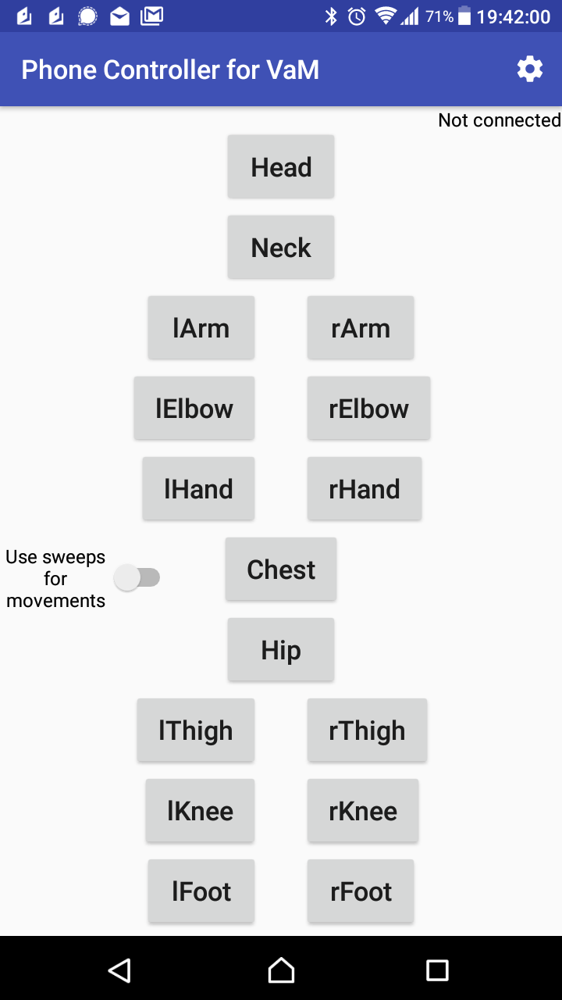

# PhoneControllerForVaM
This plugin lets you use your phone as a 3-DoF VR controller in Virt-a-Mate. 
You press a button on your phone to select a limb or the head.
Then you rotate it in any directions with your phone.

It also includes a 6-DoF attempt to move limbs around. This does not work very well due to accelerometer drift.
You still can move limb with a swift moves though. Expirience may vary with phone.

# Prerequisites

1. An **Android phone**. I designed the app to be compatible with Android 5.0+ , although I only tested it on Android 7.1.1 .

2. A local network (**Wi-Fi**), to which both phone and computer should be connected. 
Network should be configured in a way that phone and computer could see each other. 
It is a usual configuration for home networks.

# Installation and set up

### First, lets install the app on the phone. 

1. On your phone, open **Settings → Lock screen & security**. Find **Unknown sources** 
and flip the switch to the **On** state.

   At this point the app is not published at Google Play Store. It is just too early. 
The only way to install it is through the third-party installation process.
By default such process is disabled due to security consideration.
This program is provided in open sources and this lets you review the source code either youself 
or with somebody's help.

2. Open this page in a browser of your phone.

   Follow this link on your phone: <https://github.com/Eugene-E0a80fd8080ff8e/PhoneControllerForVaM/releases>

   On the page there will be list of releases. 
   Most recent one would be on top. 
   Click on *PhoneControllerForVaM.apk* to download the apk file (the file which contains the app). 
   This will open the folder with app file in it.

3. Once it is downloaded, open the file and confirm the installation.

   Open the app. It will be at the end of Apps list.

4. Once app is opened, you need to set it up.

   Click settings button at the top-right corner of the app.
Make sure there is a green message saying that magnetometer is calibrated properly (3/3). 
If it says the opposite, swing the phone in the air in the form of figure 8 (eight) couple times. 
If phone is not willing to calibrate, check if you have stong magnets on your table, or a speaker, 
or maybe you have a cover with magnetic clip on your phone.

   Once magnetometer is calibrated, point it to your phone as if you were making a nicely aligned 
picture of something on your monitor. Once magnetic direction stabilizes, click **Use this direction**.

   Press the back button.

5. Make sure your phone is connected to the Wi-Fi network and it is the same network your computer is connected to.

6. You are finished with the phone setup!

### Second, lets install the plugin for VaM.

1. On this page click **VaMplugin** to open the folder. There, click **PhoneController.cs** to open the file. 
Find the **Raw** button, right click it and choose *Save link as...*.

   Save the file to **_Your-VAM-Folder_/Custom/Scripts/** folder.

2. Open Virt-a-Mate, choose a model, opens its menu and select **Plugins** section. 

   Click **Add Plugin**. A new section will appear at the end of a list. Click **Select File...** and 
select the previously downloaded file.

   At this point The Windows Firewall might appear and ask you if you allow this application to use local network. Confirm it.

3. It should work by now.
   While using it, keep your eye on «Magnetometer not calibrated» message. If you see it, swing your phone to calibrate it. 
   (Here is no need to go to direction settings page)

### Usage

Keep **use sweeps for movement** off for a start. It does not work very well yet.

Press and hold a button and then tilt your phone to any direction. 
The model on the screen should move respective limb according to your movement.

You can press more than two buttons at once.

When **use sweeps for movement** is turned on, only four buttons change its function: lHand, rHand, lFoot, rFoot.
If you keep a button pressed for too long, you will see how your accelerometer drifts. 
This leaves only one usage for this movements: hold the button, move the phone swiftly to a new position, then release the button.
This might be improved in future releases when I would use Android's SENSOR_6DOF or Google's AR Core.

A configuration with more than one server or more than one client per local network was considered during development but was never tested.

Feedback on the plugin and the app would be appreciated.

Also, let me know if I can improve this instruction. Did I miss something?

